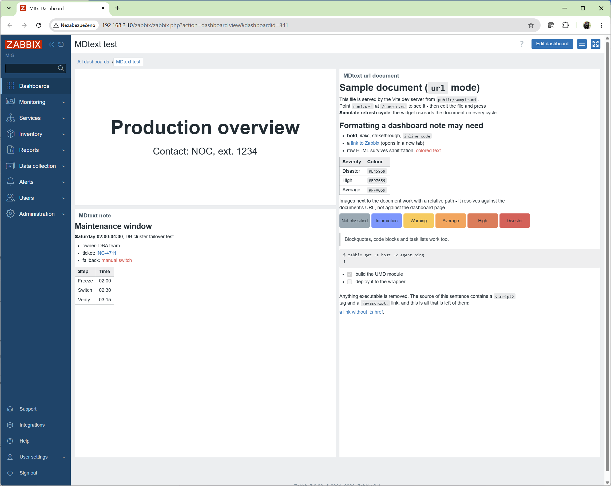
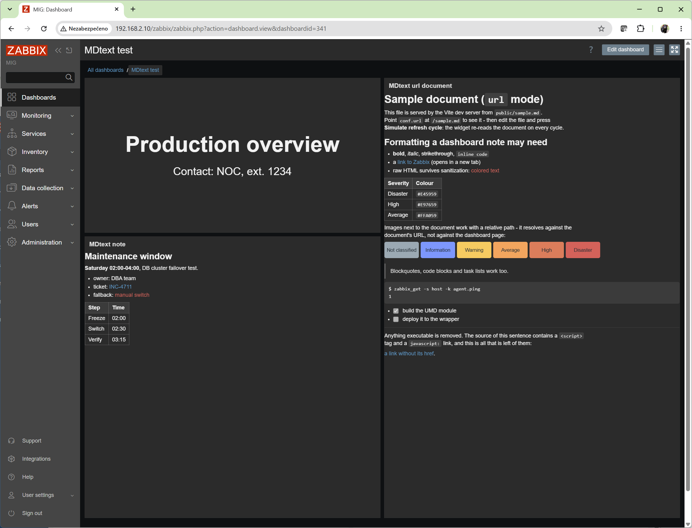

# MDtext UMD Module (for Zabbix JS Wrapper)

This directory contains a frontend widget module in UMD format, intended to be hosted by the
`js_wrapper` plugin for Zabbix.

The module renders **Markdown** in a dashboard widget. Zabbix has no widget for a heading, a
note or a legend on a dashboard; this one fills that gap. The text comes either inline from the
widget configuration or from a Markdown document at a URL.

For build, local development, and deployment steps, see `BUILD.md`.

## What the Module Does

- renders Markdown (CommonMark + GitHub Flavored Markdown: tables, strikethrough, task lists,
  autolinks) to HTML,
- takes the text inline (`text`), or loads a document (`url`) and re-reads it on every refresh
  cycle,
- sanitizes the result with DOMPurify - raw HTML in the Markdown is allowed, anything executable
  is not,
- inherits the Zabbix theme (blue, dark, high-contrast) without configuration,
- optional alignment, font scale and CSS class.

## Screenshots

Three widgets on a Zabbix 7.0 dashboard: a heading from inline `text` (header hidden,
`align: center`, `valign: middle`, `scale: 2`), a note from inline `text`, and a document
loaded from `url` with a relative image next to it.



The same dashboard in the dark theme - the widget has no colours of its own and inherits the
theme (see "Theme" below):



## Technology

- Vue 3
- Vite
- [marked](https://marked.js.org/) - Markdown parser
- [DOMPurify](https://github.com/cure53/DOMPurify) - HTML sanitizer

## UMD Host API (Wrapper Contract)

The library build publishes the API under:

- `componentName = "MDtext"`
- global export: `window.MDtext`

API shape:

```js
window.MDtext = {
  mount(el, payload) {
    return {
      destroy() {
        // unmount + cleanup
      },
      update(nextPayload) {
        // refresh without remount
      },
    };
  },
};
```

`payload` from wrapper:

- `payload.conf`: parsed JSON from `conf_json` - see "Configuration"
- `payload.context`: runtime metadata (for example `widgetid`, `rf_rate`) - not used
- `payload.zbx`: the wrapper's host API - not used, this module makes no Zabbix API calls

Every `update()` call - one per Zabbix refresh cycle - re-reads the document of the `url` mode.
The module runs no timer of its own.

## Configuration (`conf_json`)

| Key      | Default   | Description                                                                                                                                                  |
| -------- | --------- | ------------------------------------------------------------------------------------------------------------------------------------------------------------ |
| `text`   | -         | Markdown to display. `\n` starts a new line - see "Writing the text". Ignored when `url` is set                                                               |
| `url`    | -         | URL of a Markdown document, absolute or relative to the Zabbix frontend page. Re-read on every refresh cycle - see "Loading from a URL"                        |
| `align`  | `left`    | Horizontal text alignment: `left`, `center`, `right`, `justify`                                                                                              |
| `valign` | `top`     | Vertical placement of the content in the widget: `top`, `middle`, `bottom`                                                                                   |
| `scale`  | `1`       | Font size. A number multiplies the font size the dashboard uses (`1.5` = 150 %); a string is used as a CSS `font-size` as it is (`"18px"`, `"1.2rem"`)        |
| `class`  | -         | CSS class(es) added to the widget root, for deployment-specific styling                                                                                      |
| `html`   | `true`    | Pass raw HTML in the Markdown through (sanitized). With `false` HTML tags are shown as literal text                                                           |
| `breaks` | `true`    | Render a single newline as a line break. With `false` strict Markdown applies, where a single newline is a space and only an empty line separates paragraphs |
| `links`  | `new-tab` | Where links open: `new-tab` (with `rel="noopener noreferrer"`) or `same-tab`                                                                                 |

Unknown keys are ignored. Exactly one source is used: `url` when it is set, `text` otherwise.
With neither, the widget says so.

### Writing the text

`conf_json` is a JSON string, so the whole text sits on one line and a new line is written as
`\n`:

```json
{ "text": "# Production\nDatabase cluster\nOwner: DBA team" }
```

renders as a heading "Production" followed by two lines of text. Each `\n` starts a new line (the
`breaks` default); an empty line (`\n\n`) starts a new paragraph. Markdown syntax applies as
usual: `#`/`##` headings, `**bold**`, `*italic*`, lists with `- `, links as `[text](url)`, inline
`code`. Inside a JSON string a double quote must be written as `\"` and a backslash as `\\`.

A heading, centered in the widget, at twice the dashboard font size:

```json
{ "text": "# Production overview", "align": "center", "valign": "middle", "scale": 2 }
```

Tip: turn off "Show header" in the widget configuration to get a bare heading with no widget
title bar.

A document maintained outside Zabbix:

```json
{ "url": "modules/js_wrapper/assets/md/overview.md" }
```

### Loading from a URL

The document is fetched by the **browser of the person viewing the dashboard**, from the
dashboard page, as a plain `GET`. That decides what works:

**Same origin - recommended.** A relative URL, or an absolute one with the same scheme, host and
port as the Zabbix frontend, always works, because the browser applies none of its cross-origin
rules to it. Put the file anywhere the Zabbix web server serves; the module's own asset directory
is a natural place:

- URL `modules/js_wrapper/assets/md/overview.md`
- file `/usr/share/zabbix/modules/js_wrapper/assets/md/overview.md` (path of the Zabbix 7.0 RPM/DEB
  packages - adjust to your installation)

Static files under `modules/` are served by the default Zabbix web server configuration; that is
how the UMD assets themselves load. Two variants keep the documents out of the Zabbix tree while
staying on the same origin:

- **A directory of your own**, mapped into the Zabbix site. The documents survive Zabbix upgrades
  and can be maintained by other people (a `git pull` on the server, a network share):

  ```apache
  # /etc/httpd/conf.d/zabbix-docs.conf
  Alias /zabbix/docs /srv/zabbix-docs
  <Directory /srv/zabbix-docs>
      Require all granted
  </Directory>
  ```

  ```nginx
  location /zabbix/docs/ {
      alias /srv/zabbix-docs/;
  }
  ```

  and `"url": "docs/overview.md"` in the widget.

- **A reverse proxy** to the server where the documents really live (a wiki, a Git server, a
  documentation portal). The browser talks only to Zabbix, so CORS, mixed content and the login
  of the remote server all become the proxy's business and never reach the widget:

  ```apache
  # needs mod_proxy + mod_proxy_http; SSLProxyEngine only for an https:// backend
  SSLProxyEngine on
  ProxyPass        /zabbix/docs/ https://wiki.example.com/zabbix-docs/
  ProxyPassReverse /zabbix/docs/ https://wiki.example.com/zabbix-docs/
  ```

  ```nginx
  location /zabbix/docs/ {
      proxy_pass https://wiki.example.com/zabbix-docs/;
  }
  ```

  If the backend needs credentials, add them in the proxy configuration (`RequestHeader set
  Authorization ...`, `proxy_set_header Authorization ...`) - the secret then stays on the
  server instead of in `conf_json`.

**Another origin.** The browser enforces CORS (Cross-Origin Resource Sharing - its rule for
reading a resource from a different origin; not to be confused with CSRF, which is a different
mechanism): the server hosting the document must answer with the header
`Access-Control-Allow-Origin: *` (or the exact origin of the Zabbix frontend, e.g.
`https://zabbix.example.com`). Nothing else is required - the request carries no custom headers,
so there is no preflight, and the `Content-Type` of the document does not matter. Public raw
file URLs of GitHub and GitLab send this header; a wiki, SharePoint or a plain intranet web
server usually does not, and the widget then reports "Cannot load ...". Either add the header on
that server, for example

```apache
<Directory /var/www/docs>
    Header set Access-Control-Allow-Origin "https://zabbix.example.com"
</Directory>
```

```nginx
location /docs/ {
    add_header Access-Control-Allow-Origin "https://zabbix.example.com";
}
```

or copy the document next to Zabbix (same origin).

**`http://` and `https://`.** On an `http://` dashboard both `http://` and `https://` documents
load (CORS rules still apply). On an `https://` dashboard an `http://` document is blocked as
*mixed content* - always, by every browser, with no configuration around it. Serve the document
over HTTPS.

**Authentication.** Cookies are sent only to the Zabbix origin itself; a cross-origin document
must be readable without a login. There is deliberately no way to configure credentials for the
request: `conf_json` is readable by every dashboard viewer. A protected source is reached through
the reverse proxy variant above.

**Images and links inside the document.** Relative paths resolve against the document's URL, not
against the dashboard page, so `` next to `overview.md` just works and a
folder of Markdown plus images can be moved as a whole. Images are not subject to CORS (an
`` may come from any origin), but they are subject to the mixed-content rule above, and they
are requested with the cookies of their own host only - an image behind the login of another
server does not load. Keeping images next to the document, on the Zabbix origin or behind the
proxy, avoids all of it.

**Other limits.** A `Content-Security-Policy` header added by a reverse proxy in front of Zabbix
(`connect-src`) can forbid cross-origin requests. Browsers also restrict requests from a page on a
*public* address to hosts in a *private* network (Chrome "Private Network Access"); Zabbix and the
document server normally live in the same network, where this does not apply. Redirects must
satisfy CORS on every hop. Loading gives up after 10 seconds.

**Refresh.** The document is re-read on every Zabbix refresh cycle of the widget, revalidating
with the server (`cache: no-cache`): an unchanged file costs a `304`, an edited one shows up on
the next cycle. When a reload fails after a successful one, the last document stays displayed and
the error appears as a footer line (details in its tooltip); before any success the error fills
the widget.

## Theme

The widget has no colours of its own. Text inherits the widget body colour, links use the
theme's own link style, and the subtle surfaces (inline code, code blocks, table borders,
quotes) are mixed from the current text colour with `color-mix()`. The Zabbix dark and
high-contrast themes therefore work without any change to the wrapper. For deployment-specific
styling set `class` and add rules to `MDtext.css` or a custom theme.

## Security

Everything rendered passes through DOMPurify: `<script>`, event handler attributes,
`javascript:` URLs, `<style>` and similar are removed; presentational HTML such as
`<span style="color:...">`, `<br>` or `<kbd>` survives. Links open in a new tab with
`rel="noopener noreferrer"` unless `links` says otherwise. The module makes no Zabbix API calls
and does not use `zbx.api`.

## Project Structure

- `src/entry.js` - registers `window.MDtext` + `mount/destroy/update`
- `src/App.vue` - source selection, loading, rendering, layout options, styles
- `src/services/markdown.js` - marked + DOMPurify pipeline
- `src/services/source.js` - fetching a document with timeout and readable errors
- `src/main.js`, `index.html`, `public/sample.md` - standalone development harness
- `vite.lib.config.js` - UMD library build configuration

## License

MIT - see `LICENSE`. Copyright (c) 2026 TSP Data a.s.

The UMD build bundles third-party libraries under their own permissive licenses:
[Vue](https://github.com/vuejs/core) (MIT), [marked](https://github.com/markedjs/marked) (MIT)
and [DOMPurify](https://github.com/cure53/DOMPurify) (Apache-2.0 or MPL-2.0). Their copyright
notices are in the packages' own `LICENSE` files (see `node_modules/` after `npm install`).
